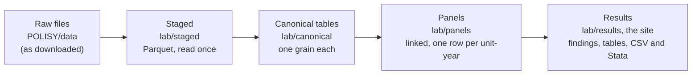
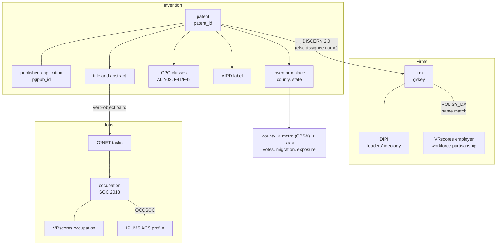

# POLISY data infrastructure

POLISY (Politics, Organizations, Leadership, Strategy & Innovation) studies how the politics of the people inside
firms, leaders and workers alike, shapes what firms invent and how they take up technologies such as AI. This document
describes the data infrastructure behind it: what each source is, how the sources are linked, what is built from them,
how the measures are defined, and how to run it. It covers the whole lab, with most detail on the parts added in
September 2026: the patent layer, the firm link, the IPUMS controls and the matching of AI patents to jobs.

## 1. What the infrastructure answers

| Question | Unit | Built from |
|---|---|---|
| Do firms whose leaders and workforce disagree politically invent less, and in which directions (AI, climate, weapons, exploration)? (Paper 1, Phase C; Seam 3) | firm-year | DIPI, VRscores, Compustat, DISCERN, PatentsView, AIPD |
| Which jobs does AI invention target, and are they Republican or Democratic jobs? (Seam 3: "do leaders automate the out-group?") | occupation-year, firm-year | AIPD, PatentsView text, O*NET tasks, VRscores |
| Where is AI invented, and does the generative-AI wave since 2022 follow the political map? | county, metro, state x year | PatentsView (granted and pre-grant), AIPD, votes |
| Who works in AI-exposed jobs (age, education, public sector, place), so exposure is not confused with demography? | occupation, industry | IPUMS ACS, VRscores, AI exposure measures |

## 2. The layers

Every source goes through the same five layers. Each layer is a folder in `MyDrive/POLISY/lab`.

1. **Raw.** Files as they were downloaded, in `MyDrive/POLISY/data` (and its subfolders one level down). Nothing is
   renamed or unzipped by hand: every input is found by its name and by the columns in its header, also inside zips
   (`polisy_lab/sources.py`, the `SOURCES` registry).
2. **Staged.** The big tables (PatentsView, the AI Patent Dataset, DISCERN's files, citations) are converted once
   to Parquet with only the columns used (`polisy_lab/staging.py`). A stamp records the source file's name, size and
   date, so a staged table is rebuilt only when its source changes. Multi-gigabyte files are read once, not at every
   run. Zipped tables are unzipped to Colab's local disk while being read.
3. **Canonical.** One table per concept with a declared grain (the columns that identify a row), for example
   `patents` (one row per patent) or `acs_occupation` (one row per occupation). Adapters in `polisy_lab/adapters/`
   build them.
4. **Panels.** Canonical tables joined into analysis units (`polisy_lab/link.py`): occupations, industries, states,
   counties and metros by year, and firms by year. Every join prints how much of it matched and is saved in
   `results/results.json` (the diagnostics table). A result is only as good as its coverage.
5. **Results.** Analyses, the graded findings and the site. The firm panels are also written as CSV and Stata files
   in `results/tables`, for work outside Python.

The heavy lifting is done by DuckDB, which reads files larger than memory and spills to local disk, so the whole
pipeline runs in a standard Colab session.

## 3. Sources

| Source | What it is | Files (in `POLISY/data`) | How we get it | Key |
|---|---|---|---|---|
| PatentsView, granted patents | Every US patent granted since 1976 with its classes, inventors, places and owners (USPTO) | `patentsview/g_patent`, `g_application`, `g_cpc_current`, `g_inventor_disambiguated`, `g_location_disambiguated`, `g_assignee_disambiguated`, `g_cpc_title`, `g_patent_abstract`, `g_us_patent_citation` (.tsv or .tsv.zip) | notebook step 4b tries PatentsView's server, which has refused scripted downloads since September 2026; then download them by hand from the [Data Download Tables pages](https://patentsview.org/download/data-download-tables) | `patent_id` |
| PatentsView, pre-grant publications | Published patent applications (published 18 months after filing, whether or not later granted) | `patentsview/pg_published_application`, `pg_cpc_current`, `pg_inventor_disambiguated`, `pg_location_disambiguated`, `pg_assignee_disambiguated`, `pg_granted_pgpubs_crosswalk`, `pg_published_application_abstract` | step 4b | `pgpub_id` |
| USPTO AI Patent Dataset (AIPD) | The USPTO's machine-learning classification of every patent and published application into eight AI components (Giczy, Pairolero and Toole 2022; 2023 update) | `aipd/ai_model_predictions` (.csv or zip) | step 4b tries the USPTO page; otherwise download it by hand | document number |
| DISCERN 2.0 | Which Compustat firm owns each patent, following subsidiaries and ownership changes, patents granted 1980-2021 (Arora, Belenzon and Sheer) | every file of the download in `discern/` (`discern_pat_grant_1980_2021`, `discern_sub_names`, `discern_uo_names`, the firm panel; `discern_pub_1980_2021`, the publications, is not used) | your copy (used in the thesis) | patent number, `permno_adj` |
| CRSP/Compustat Merged link table | `permno_adj` -> `gvkey` when no DISCERN file carries both (WRDS, `ccmxpf_lnkhist`: primary links LU/LC, P/C, by year of the link's dates) | any name containing `ccmxpf`, `lnkhist`, `ccm_link` or `permno_gvkey` | WRDS | `lpermno`, `gvkey` |
| Compustat | Firm financials and company names (WRDS) | `Compustat_Final.csv` | your copy | `gvkey` |
| DIPI | Political ideology of CEOs, top teams and employees from donations (Mannor and Busenbark) | `Organizational_Leadership_File.csv` | your copy | `gvkey`, year |
| VRscores | Party registration of 24.5 million workers by employer, occupation, industry and metro, 2012-2024 (Kagan, Frake and Hurst) | the four Dataverse zips | your copy; POLISY_DA builds the panels | employer name, SOC, NAICS, metro |
| IPUMS USA | American Community Survey microdata, 2019-2023 5-year file, about 16 million people | `ipums/usa_000NN.csv.gz` (or `.dat.gz` with its `.xml` codebook) | step 4c orders it through the IPUMS API with your free key | person (weighted) |
| O*NET 29.0 | The task statements of every occupation and their importance ratings | `db_29_0_text.zip` (`Task Statements.txt`, `Task Ratings.txt`) | downloaded automatically | O*NET-SOC code |
| Exposure and context | AIOE, DAIOE, BTOS, CSPP, IRS migration, county returns, telework shares, county context | see `data/README.md` | downloaded automatically | SOC, NAICS, FIPS |

`data/README.md` lists every file name the code looks for. If the wrong file is picked, point the code at the right
one: `pc.CONFIG["LAB_<SOURCE>_<ROLE>"] = path` (for example `LAB_DISCERN_TABLES`, `LAB_IPUMS_DATA`).

## 4. How the units connect

The keys, and how each link is made:

| Link | How | What can go wrong, and how it is checked |
|---|---|---|
| published application -> patent | `pg_granted_pgpubs_crosswalk` | applications not granted (yet) have no patent: kept as pending |
| patent -> firm (gvkey) | DISCERN 2.0's patent-level files first: `discern_pat_grant_1980_2021` (the owner when the patent was granted, grants of 1980-2021) and `discern_pat_app_1980_2021` (the owner when it was filed, applications of 1980-2021, some granted after 2021). Where the two differ (a firm bought between filing and grant) the owner at filing is used, since the panel counts patents by filing year (`discern_owner`); the log counts these patents. DISCERN names the owner by `permno_adj`, which is mapped to `gvkey` by year, from the first of: a DISCERN file carrying both, WRDS's CRSP/Compustat Merged link table, the `LPERMNO` column of the Compustat file (each fills only the firm-years the ones before it leave open). The log reports the share of DISCERN's patents that get a `gvkey` and the owners that do not | DISCERN ends with patents granted in 2021 |
| patent -> firm after DISCERN | Grants after the last fiscal year of DISCERN's grant file (2021; firms' fiscal years end in other months, so it also holds some grants of early 2022) that DISCERN does not link: the patent's assignee (PatentsView's disambiguated organization) matched by name to Compustat names and DISCERN's names: its subsidiary and ultimate-owner lists (each owner spell of a name, `permno_adj1`, `fyear1`, `nyear1`, `permno_adj2`, ..., with its years) and the assignee names on the patents it gives each firm. Names are normalized the same way as the VRscores employer match (`polisy_core.norm_name`). Exact matches first, then fuzzy at 95 of 100 or more for assignees with 5 or more documents; a name several firms held (a subsidiary sold, two firms of one name) goes to the firm that held it last within the assignee's patenting years, the owner of the recent patents the name match fills in | measured out of sample: the name list as it stood three years before DISCERN's last grant year, scored against DISCERN on the grants of those three years (the share of DISCERN's patents it finds, and how often it names DISCERN's firm). That is its error rate on the grants after DISCERN |
| published application -> firm | its patent's link once granted; else the assignee name | pending applications rely on names only |
| firm -> VRscores workforce | POLISY_DA module 04 (employer names to Compustat) | module 07 validates against DIPI |
| inventor -> place | `g_location_disambiguated`: state and county FIPS; the state from the postal code when the FIPS code is missing | inventors abroad are counted in a patent's inventors but not placed |
| occupation (SOC 2018) -> IPUMS | the most specific OCCSOC code that fits. The ACS merges occupations it cannot tell apart in two ways: X or Y for any digit (11-9111 -> `1191XX`) and the SOC hierarchy's broad codes, whose trailing zeros stand for any digit (11-2032 -> `112030`; the physicians' broad code `291210` also holds 29-1221 to 29-1229). Each occupation tries its own code, then its SOC 2018 and SOC 2010 links | coverage in the diagnostics; the log lists the largest occupations left without a profile |
| industry (NAICS-4) -> IPUMS | the INDNAICS codes within the NAICS-4 industry, weighted by workers; where the ACS only has a coarser code, that code stands in (`acs_coarse`) | the number of coarse industries is in the diagnostics |
| AI patent -> occupation | shared verb-object pairs between the patent's text and the occupation's O*NET tasks (section 6.6) | spaCy's parser makes errors; incidence uses only pairs specific to few occupations |

## 5. What is built

### 5.1 The patent layer (`adapters/patents.py`)

| Table | One row per | Main columns |
|---|---|---|
| `aipd` | patent or published application | `ai` (the AIPD label at the chosen threshold), `ai_strict`, the eight components `aipd_ml`, `aipd_evo`, `aipd_nlp`, `aipd_speech`, `aipd_vision`, `aipd_kr`, `aipd_planning`, `aipd_hardware` |
| `patents` | utility patent, not withdrawn | `year` (grant), `grant_date`, `app_year` and `filing_date` (filing), `num_claims`; CPC flags `ai` (narrow), `ai_broad`, the subfields `sub_*`, `climate`, `weapons`; `main_subclass`, `n_subclasses`; AIPD `ai_aipd`, `ai_aipd_strict`, `aipd_*`; `n_inventors`, `n_us_inventors`, `first_inventor_state`; first assignee `assignee_id`, `assignee_org`, `assignee_type`, `n_assignees` |
| `applications` | published application (its first publication; republications of the same application are dropped) | `app_year`, `pub_year`, `granted_patent_id`, the same flags and AIPD labels, first assignee |
| `patent_places`, `application_places` | document x inventor in the US | state, county, coordinates, `share` = 1 / inventors on the document, flags |
| `patents_state_year`, `patents_county_year` | place x grant year | fractional patents, AI (narrow, broad, AIPD), climate, inventors |
| `inventions_year`, `inventions_state_year`, `inventions_county_year` | (place x) filing year | granted patents and published applications, with AI (CPC and AIPD), climate and weapons; `applications_granted` |
| `ai_cpc_edges`, `inventor_moves` | class pair x period; origin x destination x year | the technologies AI is combined with; inventors moving between states |

### 5.2 Firms (`adapters/firms.py`)

| Table | One row per | Main columns |
|---|---|---|
| `discern_patents` | patent x firm (DISCERN) | `gvkey`, `permno_adj`, `discern_year` |
| `discern_firm_year` | firm-year | DISCERN's own panel as delivered, to compare with the thesis |
| `assignee_gvkey` | company assignee matched to a firm | `gvkey`, `method` (exact, fuzzy), `score`, `ambiguous`, `docs` |
| `patent_firm`, `application_firm` | document x firm | `link` (discern, name), `share` = 1 / firms owning the document |
| `patent_citations` | patent | `back_cites`, `fwd_cites`, `fwd_cites_5y` (empty for patents granted in the last five years of the data) |
| panel `firm_patents_year` | firm (gvkey) x filing year | see 5.3 |
| panel `panel_firm_year` | firm x year | `firm_patents_year` with the VRscores workforce (`vr_*`, POLISY_DA's `firm_year`) and DIPI (`dipi_*`) |

### 5.3 The firm-year panel

`firm_patents_year` (also `results/tables/firm_patents_year.csv` and `.dta`), one row per `gvkey` and filing year. In
the Stata file, names longer than Stata's 32 characters are shortened by fixed abbreviations (Liberalism -> Lib,
Employee -> Emp, Alignment -> Align, ...) and keep the full name as their variable label:

| Column | Meaning |
|---|---|
| `pat_filed` | granted patents filed in the year (fractional when several firms own a patent) |
| `pat_granted` | patents granted in the year |
| `ai_filed`, `ai_label_covered` | AI patents by the chosen label (`ai_label`, AIPD by default), and how many patents that label covers |
| `ai_aipd_filed`, `ai_cpc_filed`, `ai_cpc_narrow_filed` | AI patents by each label, side by side |
| `climate_filed`, `weapons_filed` | Y02/Y04S and F41/F42 patents |
| `explore_filed`, `new_subclasses`, `prior_patents` | exploration (6.4) and the firm's patents in the window before |
| `cites_fwd5_filed` | forward citations within five years of grant |
| `back_cites`, `search_depth`, `search_scope` | Katila and Ahuja's search measures (6.5) |
| `apps_filed`, `apps_ai_aipd_filed`, `apps_ai_cpc_filed`, `apps_pending` | published applications filed in the year, AI among them, and those not granted |
| `pat_discern`, `pat_name` | how the year's patents were linked to the firm |

Philip's application-year dependent variable is `pat_filed` (and its AI, climate and exploratory parts).

### 5.4 IPUMS controls (`adapters/ipums.py`)

| Table | One row per | Columns |
|---|---|---|
| `acs_occupation` | occupation (OCCSOC) | `workers`, `n`, `age`, `age_under30`, `age_55plus`, `female`, `white_nh`, `black_nh`, `hispanic`, `asian_nh`, `ba_plus`, `graduate`, `public_sector`, `self_employed`, `nonprofit`, `work_from_home`, `log_wage_ft`, `inferred_party_states`, `hhi_states`, `hhi_metros` |
| `acs_industry` | industry (INDNAICS) | the same |
| `acs_occ_state`, `acs_occ_metro` | occupation x state, occupation x metro | workers: where each occupation's jobs are |
| `acs_ind_occ` | industry x occupation | workers: each industry's occupation mix (the structural part of Seam 1) |

The occupation panel gets these as `acs_*` columns, the industry panel likewise.

### 5.5 AI invention and jobs (`adapters/tasks.py`)

| Table | One row per | Columns |
|---|---|---|
| `onet_tasks`, `onet_task_pairs` | task; task x verb-object pair | SOC code, task text, importance |
| `webb_pairs` | period x pair | AI inventions with the pair, their share of the period's AI inventions |
| `occ_ai_invention` | occupation x period | `exposure`, `percentile`, `tasks`, `tasks_matched` |
| `patent_occ_incidence` | AI invention x occupation | `touch`, `incidence` |
| `occ_ai_incidence_year` | occupation x filing year | `ai_incidence` (fractional AI inventions targeting the occupation), `ai_inventions_touching` |

The occupation panel gets `webb_ai_invention` (all periods), `webb_ai_invention_recent` (the latest period), their
percentiles, and `ai_incidence_total`, `ai_incidence_5y`.

## 6. Measures

### 6.1 Dates

A patent has a filing date (application) and a grant date, usually two to three years apart. Invention is dated by
filing (`app_year`), as Philip asked. Two consequences:

- **Truncation.** Patents filed in the last two or three years of the data are mostly not granted yet, so granted
  counts by filing year fall at the end. Compare firms within years (year fixed effects), or stop the sample three
  years before the data's last grant year.
- **Published applications** appear 18 months after filing, granted or not, so they show recent invention (the
  generative-AI wave) years before grants do. Applicants who file only in the US can ask not to be published, so
  applications undercount somewhat. A published application that is later granted is counted once, as the patent.

### 6.2 AI

- **AIPD (the default label).** The USPTO's model scores every document on eight AI components (machine learning,
  evolutionary computation, natural language processing, speech, vision, knowledge processing, planning and control,
  AI hardware). A document is AI when any component's prediction is positive at the chosen threshold
  (`aipd_threshold`: 50, the dataset's default; 86 or 93 for fewer false positives, when the file has them).
- **CPC rules (for comparison, and for documents the AIPD does not cover).** Narrow: G06N (machine learning) except
  quantum computing (G06N10). Broad: adds image and video recognition (G06V), image analysis (G06T7), natural language
  (G06F40), speech (G10L15, G10L13), learning control (G05B13) and robot learning (B25J9/161, B25J9/163).
- The log reports how often the two agree. The AIPD ends with its last update. `ai_label` decides which label the
  firm panel's `ai_filed` uses, and `ai_label_covered` shows how many patents the label covers in each firm-year.

### 6.3 Climate and weapons

- **Climate:** any CPC class in Y02 (technologies for climate change mitigation and adaptation) or Y04S (smart grids).
- **Weapons:** any class in F41 (weapons) or F42 (ammunition, blasting).

### 6.4 Exploration

A patent is **exploratory** when its main CPC subclass (the first listed) appears on none of the firm's patents filed
in the previous W years (`explore_window`, 5). `new_subclasses` counts the subclasses the firm used in the year but
not in the window. A firm without patents in the window (`prior_patents` = 0) has only exploratory patents by this
definition, so condition on `prior_patents` > 0 where that matters. PatentsView starts with the patents granted in
1976, so earlier filing years are incomplete: the panel starts in 1976, and exploration and search are left empty
before 1976 plus W (1981), because the firm's history is not in the data.

### 6.5 Search depth and scope (Katila and Ahuja 2002)

With the citations a firm's patents filed in year t make to earlier US patents, and n_t(c) the number of times the
firm cites patent c in year t:

- **Search depth** = Σ_c n_t(c) × n_prior(c) / Σ_c n_t(c), where n_prior(c) is the number of times the firm cited c in
  years t-5 to t-1: how intensely the firm reuses knowledge it has searched before.
- **Search scope** = Σ_c n_t(c) × [n_prior(c) = 0] / Σ_c n_t(c): the share of this year's citations that are new to
  the firm.

They need `g_us_patent_citation` (step 4b, "citations"). The test suite checks both on a worked example.

### 6.6 Which jobs AI invention targets (after Webb 2020)

1. Every text is parsed with spaCy and reduced to **verb-object pairs** of lemmas: "Method for diagnosing diseases
   using neural networks" gives (diagnose, disease). Verbs joined by "and" share their object. Light verbs that say
   nothing about the work (be, have, include, comprise, use, provide, and a few more) are dropped. O*NET task
   statements are parsed the same way ("Diagnose and treat patients" gives diagnose patient, treat patient).
2. **AI inventions**: granted patents and pending published applications with the AI label, dated by filing year.
   Their text: the title and the first 60 words of the abstract (`webb_text`, `webb_abstract_words`).
3. **Exposure** (Webb's measure): a pair's weight in a period is the share of that period's AI inventions whose text
   contains it. A task's exposure is the sum of its pairs' weights, and an occupation's is the average over its tasks,
   weighted by O*NET task importance. It is reported by filing period (1976-2011, 2012-2016, 2017-2021, 2022 on) and
   for all periods together, with each occupation's percentile.
4. **Incidence** (whose work a given AI invention touches): an invention touches a task when they share a pair that
   appears in at most 5% of occupations, so generic pairs ("analyze data") do not count. An occupation's touch is the
   share of its task importance touched. Each invention's touches are scaled to sum to one, so summing over inventions
   gives fractional AI inventions per occupation and year (`occ_ai_incidence_year`).

Combined with `patent_firm`, incidence says which occupations a firm's AI patents target. With VRscores, it says
whether they are Republican or Democratic occupations: the measure behind "do leaders automate the out-group?"
(Seam 3).

### 6.7 IPUMS profiles

Employed people aged 16 and over (EMPSTAT = 1), weighted by PERWT, pooled over the 2019-2023 5-year file (its weights
represent the average population over the five years):

- **Education:** bachelor's degree or more (EDUCD 101 and up); graduate degree (114 and up).
- **Public sector:** federal, state and local government employees and the armed forces (CLASSWKRD 24-28).
- **Self-employed:** CLASSWKR = 1. **Non-profit:** CLASSWKRD 23.
- **Worked from home:** TRANWORK = 80, among those who answered.
- **Wage:** the mean log wage of full-time workers (35+ usual hours).
- **Inferred-party states:** the share of jobs in the 19 states where VRscores infers party from primary voting or L2's
  model (polisy_core's PRIMARY_STATES and MODELED_STATES).
- **Concentration:** Herfindahl index of the jobs across states and across metros.

## 7. Running it

In the Colab notebook (`lab/notebooks/POLISY_AI_Innovation_Lab.ipynb`), after steps 1-3:

| Step | Flag | What it does | Time |
|---|---|---|---|
| 4b | `GET_PATENT_DATA = True`, `PV_TABLES` | downloads PatentsView's tables (sets "core", "pregrant", "text", "citations"), the AIPD file and O*NET into `POLISY/data` | once; depends on the connection |
| 4c | `GET_IPUMS = True` | orders the IPUMS extract with your API key (Colab secret `IPUMS_API_KEY`), waits, saves it | once; IPUMS takes minutes to an hour |
| 6b | `RUN_PATENT_LAYER = True` | the patent layer, the firm link and the firm panels | tens of minutes the first time (staging), minutes after |
| 6c | `RUN_TASK_MATCHING = True` | the task matching | an hour or more the first time (parsing); cached and resumable |

Steps 6b and 6c print what to check: the number of utility patents and the share with a filing year, AIPD coverage,
which DISCERN file was read as what (lines starting `discern:`) and the share of DISCERN's patents given a `gvkey`,
how often DISCERN's two files disagree on the owner, the name match's out-of-sample agreement with DISCERN, the share of company-assigned patents linked to a firm, and the
share of AI inventions matched to at least one occupation. The diagnostics table (step 6) has every link's coverage.

Settings the team may want to change are in `LAB["SETTINGS"]` (`polisy_lab/core.py`): `ai_label`, `aipd_threshold`,
`explore_window`, `name_fill` (when the name match may fill in for DISCERN: after its last grant year, for any patent
it leaves unlinked, or never), `discern_owner` (a patent's owner at filing or at grant), `cspp_vars` (the CSPP
variables the state panel uses, by name; the canonical `cspp_catalog` lists them with their descriptions), `name_min_score`,
`webb_text`, `webb_abstract_words`, `webb_model`, `webb_periods`, `webb_generic_share`.

## 8. Choices and limits

- **Everything above is tested on stand-in files only** (`tests/infrastructure_test.py`: the published file layouts
  with a few made-up rows, checked against hand-computed values). The first run on the real files is in Colab, and
  its log lines are the first real check.
- **Fractional counts.** A patent with inventors in two counties counts half in each; one owned by two firms counts
  half for each.
- **The name match is a fallback.** It misses subsidiaries whose names differ from the parent's (DISCERN's name lists
  help) and can link a patent to a firm that merely shares a name. Its agreement with DISCERN, measured out of sample
  at every run (names as known three years before DISCERN ends, scored on those three years), says how far to trust
  it after 2021.
- **Label coverage.** The AIPD covers documents up to its last update; later documents fall back to the CPC rules in
  the task matching (the firm panel keeps the labels apart).
- **Parser errors.** spaCy's English models misread some sentences (a verb taken for a noun, an object attached to
  the wrong verb). The medium model is the default; the error adds noise but no direction we know of.
- **IPUMS codes.** The ACS merges some occupations and industries (X digits in OCCSOC, codes such as 3MS in
  INDNAICS); those units get the merged group's profile.
- **Grant lag and publication.** See 6.1.

## 9. Code map

| File | Role |
|---|---|
| `polisy_lab/sources.py` | the registry of sources (`SOURCES`), file discovery, downloads (`fetch_patentsview`, `fetch_aipd`, `fetch_onet`) |
| `polisy_lab/staging.py` | big tables to Parquet once (`stage`), local scratch disk, DuckDB connections |
| `polisy_lab/adapters/patents.py` | AIPD, granted patents, published applications, inventions by filing year |
| `polisy_lab/adapters/firms.py` | DISCERN, the assignee-name match, patent and application links to firms, citations, the firm panels |
| `polisy_lab/adapters/ipums.py` | the IPUMS extract request and the ACS profiles; the SOC and NAICS links |
| `polisy_lab/adapters/tasks.py` | O*NET tasks, verb-object pairs, Webb exposure and incidence |
| `polisy_lab/link.py` | the panels, with a diagnostic line per join |
| `tests/infrastructure_test.py`, `tests/infra_fixtures.py` | the checks on stand-in files |
| `POLISY_DA/` | the VRscores, Compustat, DIPI, ACS metro and OEWS pipeline the lab builds on |

## References

- Arora, A., Belenzon, S. and Sheer, L. (2021). Knowledge spillovers and corporate investment in scientific research.
  *American Economic Review* 111(3). (DISCERN)
- Giczy, A. V., Pairolero, N. A. and Toole, A. A. (2022). Identifying artificial intelligence (AI) invention: a novel
  AI patent dataset. *Journal of Technology Transfer* 47. (AIPD)
- Katila, R. and Ahuja, G. (2002). Something old, something new: a longitudinal study of search behavior and new
  product introduction. *Academy of Management Journal* 45(6).
- Ruggles, S. et al. IPUMS USA. Minneapolis: IPUMS.
- Webb, M. (2020). The impact of artificial intelligence on the labor market. Working paper, Stanford University.
